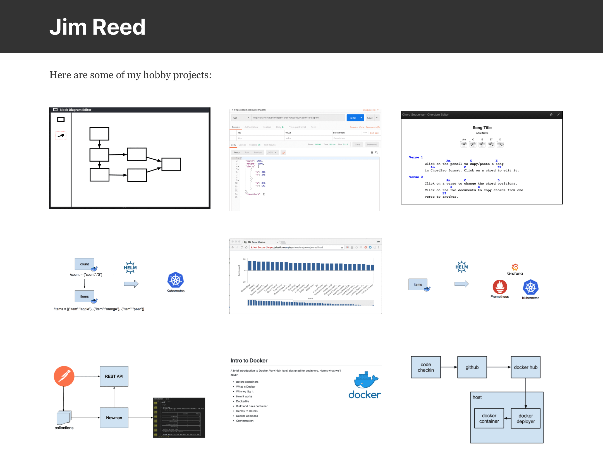

# Personal Website - Gatsby
Personal website built with Gastby.


<p  align="center">
    
</p>


## Setup

```
npm install -g gatsby-cli
npm install
gatsby develop
```

## Run
> http://localhost:8000

## Cleanup
```
rm -rf .cache
rm -rf public
rm -rf node_modules
```

## Development - Graphql
> http://localhost:8000/___graphql

## Docker Build
```
docker build --tag personal-website-image .
docker run --name personal-website -p 8000:8000 -d personal-website-image
```
or
```
docker run --name personal-website -p 8000:8000 -d jimareed/personal-website-gatsby
```

